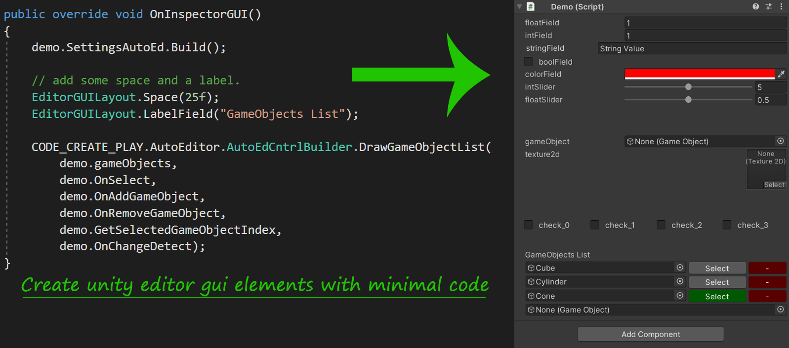
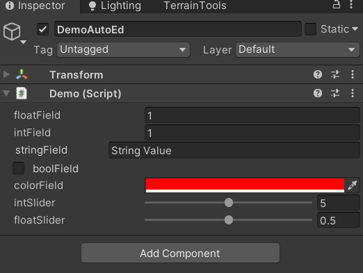
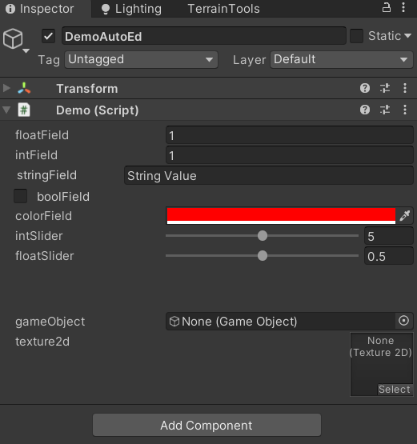
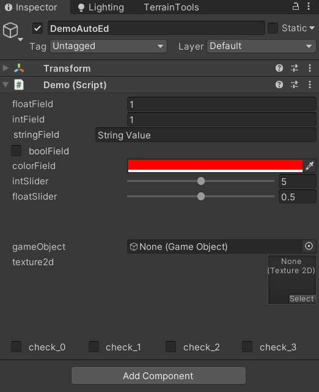
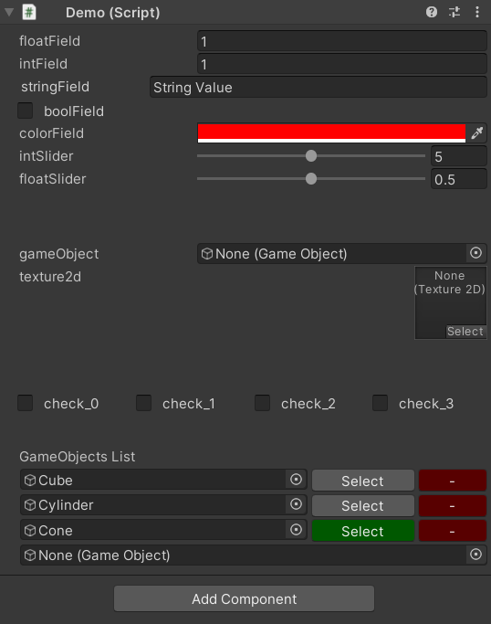

## Unity AutoEditor 



**AutoEditor** for unity allows to automatically creates Unity editor GUI elements and significantly reduces the time it takes to write a tool and allows developers to focus more on programming the actual functionality.
It works by extending unity with custom attributes which can be added on various C# fields, almost all C# fields and most of unity's editor GUI elements are supported, here is a complete list  

1. float field
2. int field
3. bool field
4. vector2
5. vector3
6. boldLabel
7. text
8. textControl
9. space
10. layer field
11. tag
12. int slider
13. float slider
14. colour
15. game object
16. texture2d
17. unity terrain field
18. list of game objects

Settings up a field to auto build is easy, just add the appropriate **Attribute**, all **AutoEditor's** custom attributes take some input arguments, however name of field and input argument "_name" must be same.

```
[EditorFieldAttr(ControlType.floatField, _name: "floatField")]
public float floatField = 1.0f;
```

Currently there are only 3 attributes...

1. EditorFieldAttribute
2. IntSliderAttribute
3. FloatSliderAttribute 

**There is a demo included in **DemoFolder** which shows entire functionality of AutoEditor.**

### Step by step instruction

1. Clone / Download this repository and import it in your project.
2. In your project panel create a new folder **Demo** and in it create another folder **Editor**.
3. In your Demo folder create a new C# script **Demo.cs** and in your Editor folder create a new C# script **DemoEditor.cs**.
4. Attach Demo.cs to an emtpy game object and open it up is VS, create a new class **Settings**, add some generic fields, also add appropriate attributes.

```
using UnityEngine;
using CodeCreatePlay.AutoEditor;


public class Demo : MonoBehaviour
{
    [System.Serializable]
    public class Settings
    {
        [EditorFieldAttr(ControlType.floatField, _name: "floatField")]
        public float floatField = 1.0f;

        [EditorFieldAttr(ControlType.intField, "intField")]
        public int intField = 1;

        [EditorFieldAttr(ControlType.textControl, "stringField")]
        public string stringField = "String Value";

        [EditorFieldAttr(ControlType.boolField, "boolField")]
        public bool boolField = false;

        [EditorFieldAttr(ControlType.color, "colorField")]
        public Color colorField = Color.red;


        // all other controls except intSliders and float sliders
        // use EditorFieldAttr, int and float sliders use intSliderAttr and
        // floatSliderAttr respectively.

        [IntSliderAttr(ControlType.intSlider, "intSlider", 0, 10)]
        public int intSlider = 5;

        [FloatSliderAttr(ControlType.floatSlider, "floatSlider", 0f, 1f)]
        public float floatSlider = 0.5f;

        // ----------------------------------------------------------
    }

    [SerializeField] private Settings settings = new Settings();
}
```

5. Now create an **AutoEditor** instance for settings class, **AutoEditor** takes type of class and a reference to the object itself, here I am using a **Getter** to return an instance of settings class.

```
    private AutoEditor settingsAutoEd = null;

    public AutoEditor SettingsAutoEd
    {
        get
        {
            if(settingsAutoEd == null)
            {
                System.Object obj = settings;
                settingsAutoEd = new AutoEditor(typeof(Settings), ref obj);
            }

            return settingsAutoEd;
        }
    }
```

6. To actually show them in editor open the **DemoEditor.cs** script and add the boilerplate editor code.

```
using UnityEditor;


[CustomEditor(typeof(Demo))]
public class DemoEditor : Editor
{
    Demo demo = null;

    private void OnEnable()
    {
        demo = target as Demo;
    }

    public override void OnInspectorGUI()
    {
    }
}
```

7. Now in **OnInspectorGUI** method just call **Build** method of **settingsAutoEd**, and there you have it.

```
    public override void OnInspectorGUI()
    {
        demo.SettingsAutoEd.Build();
    }
```



8. Use **ControlType.Space** to add space between gui elements.

```
// **previous code **

// ** this field must be NonSerialized **
[EditorFieldAttr(ControlType.space, "space_01")]
[System.NonSerialized] public int space_01 = 25;

[EditorFieldAttr(ControlType.gameObject, "gameObject")]
public GameObject gameObject = null;

[EditorFieldAttr(ControlType.texture2d, "texture2d")]
public Texture2D texture2d = null;
```



9. It is also possible to create horizontal layout just pass **layoutHorizontal = 1** to begin a horizontal layout and **layoutHorizontal = -1** when you want to end it.

```
// ** begin layout horizontal by passing layoutHorizontal = 1 **
[EditorFieldAttr(ControlType.boolField, "check_0", layoutHorizontal:1)]
public bool check_0 = false;

[EditorFieldAttr(ControlType.boolField, "check_1")]
public bool check_1 = false;

[EditorFieldAttr(ControlType.boolField, "check_2")]
public bool check_2 = false;

// ** begin layout horizontal by passing layoutHorizontal = -1 **
[EditorFieldAttr(ControlType.boolField, "check_3", layoutHorizontal: -1)]
public bool check_3 = false;
```



10. There is just one more feature I.E **GameObjectsList**, it's a simple list for referencing GameObjects or prefabs with a select and remove button, it's an editor only function and take several functions as arguments and the target list of GameObjects, to use it open **DemoEditor.cs** and add the following code (see comments for details).

```
// ^^ previous code ^^

// add some space and a label.
EditorGUILayout.Space(25f);
EditorGUILayout.LabelField("GameObjects List");


// arg 1 = list of gameObjects
// arg 2 = method to call when select button is pressed
// arg 3 = method to call when a new gameObject is added
// arg 4 = method to call when gameObject is removed
// arg 5 = method to get index of user selected item
// arg 6 = when a gameObject is replaced with another

CODE_CREATE_PLAY.AutoEditor.AutoEdCntrlBuilder.DrawGameObjectList(
            demo.gameObjects,
            demo.OnSelect,
            demo.OnAddGameObject,
            demo.OnRemoveGameObject,
            demo.GetSelectedGameObjectIndex,
            demo.OnChangeDetect);
```

and the corresponding additions to **Demo.cs** 

```
    // ^^ previous code ^^
    
    public List<GameObject> gameObjects = new List<GameObject>();
    
    // the index of item in gameObjects list when select button is
    pressed
    private int selectedGameObject = -1;  

    public void OnAddGameObject(GameObject go)
    {
        gameObjects.Add(go);
        if (gameObjects.Count > 1)
            selectedGameObject = gameObjects.Count - 2;
    }

    public void OnRemoveGameObject(int index)
    {
        gameObjects.RemoveAt(index);
    }

    public void OnChangeDetect(int index, GameObject go)
    {
        gameObjects[index] = go;
        OnSelect(index);
    }

    public void OnSelect(int index)
    {
        selectedGameObject = index;
    }

    public int GetSelectedGameObjectIndex()
    {
        return selectedGameObject;
    }
```

& that's it.

