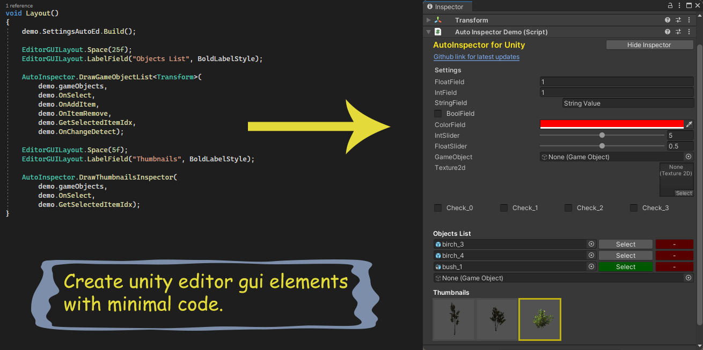

## Unity AutoInspector



If you want to avoid writing repetitive code when creating custom inspectors in unity, than consider using **AutoInspector**, a small plugin to automatically layout GUI elements, it will make your code look clean and will also help you focus on more on programming the actual functionality.  
To include a GUI element in the auto build just add the appropriate **Attribute** to a field.  
There are three **Attributes** in total  
*  EditorFieldAttribute
*  IntSliderAttribute
*  FloatSliderAttribute

The first argument to a **EditorFieldAttribute** is always the type of control and second argument is the name of field.

```
[EditorFieldAttr(ControlType.floatField, _name: "floatField")]
public float floatField = 1.0f;
```

**IntSlider** and **FloatSlider** attributes take two additional arguments the min and max values.

```
[IntSliderAttr(ControlType.intSlider, "intSlider", 0, 10)]
public int intSlider = 5;

[FloatSliderAttr(ControlType.floatSlider, "floatSlider", 0f, 1f)]
public float floatSlider = 0.5f;
```

Currently following fields are supported

**_float, int, bool, vector2, vector3, boldLabel, text, textControl, space, layer field, tag, int slider, float slider, color, game object, texture2d, unity terrain field, game objects list_**

**To see AutoInspector in action, there is a demo included with project files.**

****

## Step by step instruction

1. Clone / Download this repository and import it in your project.
2. In your project create a new folder **Demo** and inside it create another folder **Editor**.
3. In your **Demo folder** create a new script **Demo.cs** and another script **DemoEditor.cs** in **Editor folder.**
4. Attach **Demo.cs** to a game object and open it up is VS, create a new class **Settings**, add some generic fields, also add **AutoInspector** attributes.

```
using UnityEngine;
using CodeCreatePlay.AutoEditor;


public class Demo : MonoBehaviour
{
    [System.Serializable]
    public class Settings
    {
        [EditorFieldAttr(ControlType.boldLabel, name: "Settings")]
        [EditorFieldAttr(ControlType.floatField, name: "floatField")]
        public float floatField = 1.0f;

        [EditorFieldAttr(ControlType.intField, "intField")]
        public int intField = 1;

        [EditorFieldAttr(ControlType.textControl, "stringField")]
        public string stringField = "String Value";

        [EditorFieldAttr(ControlType.boolField, "boolField")]
        public bool boolField = false;

        [EditorFieldAttr(ControlType.color, "colorField")]
        public Color colorField = Color.red;

        [IntSliderAttr(ControlType.intSlider, "intSlider", 0, 10)]
        public int intSlider = 5;

        [FloatSliderAttr(ControlType.floatSlider, "floatSlider", 0f, 1f)]
        public float floatSlider = 0.5f;

        [EditorFieldAttr(ControlType.gameObject, "gameObject")]
        public GameObject gameObject = null;

        [EditorFieldAttr(ControlType.texture2d, "texture2d")]
        public Texture2D texture2d = null;

        [EditorFieldAttr(ControlType.space, "space")] // Use controlType.space to add space between two elements
        [System.NonSerialized] public int space = 10; // ControlType.Space should be NonSerialized

        // ----------------------------------------------------------
    }

    [SerializeField] 
    private Settings settings = new Settings();
}
```

5. Now create an **AutoInspector** instance for settings class, **AutoInspector** takes type of class and a reference to the object itself, I am using a **getter** to return a **AutoInspector** instance of settings class.

```
    private AutoInspector settingsAutoInspector = null;

    public AutoInspector SettingsAutoInspector
    {
        get
        {
            if(settingsAutoInspector == null)
            {
                System.Object obj = settings;
                settingsAutoInspector = new AutoInspector(typeof(Settings), ref obj);
            }

            return settingsAutoInspector;
        }
    }
```

6. Open **DemoEditor.cs** script and add the boilerplate code.

```
using UnityEngine;
using UnityEditor;
using CodeCreatePlay.AutoInspector;


[CustomEditor(typeof(Demo))]
public class DemoEditor : Editor
{
    Demo demo = null;

    private void OnEnable()
    {
        demo = target as Demo;
    }

    public override void OnInspectorGUI()
    {
    }
}
```

7. Now to actually build the inspector call the **Build** method of **SettingsAutoInspector**.

```
    public override void OnInspectorGUI()
    {
        demo.SettingsAutoInspector.Build();
    }
```


8. It is also possible to create horizontal layout just pass **layoutHorizontal = 1** to begin a horizontal layout and **layoutHorizontal = -1** to end it.

```
// horizontal layout
[EditorFieldAttr(ControlType.boolField, "check_0", layoutHorizontal:1)] // begin a horizontal layout by passing layoutHorizontal = 1
public bool check_0 = false;

[EditorFieldAttr(ControlType.boolField, "check_1")]
public bool check_1 = false;

[EditorFieldAttr(ControlType.boolField, "check_2")]
public bool check_2 = false;

[EditorFieldAttr(ControlType.boolField, "check_3", layoutHorizontal: -1)] // end horizontal layout by passing layoutHorizontal = -1
public bool check_3 = false;
```


10. To create a list of **GameObjects** with select and remove buttons, use the **AutoEditor.DrawGameObjectList**.

```
        // arg 1 = list of gameObjects
        // arg 2 = method to call when select button is pressed
        // arg 3 = method to call when a new gameObject is added
        // arg 4 = method to call when gameObject is removed
        // arg 5 = method to get index of selected item
        // arg 6 = when a gameObject is replaced with another

        AutoInspector.DrawGameObjectList<Transform>(
            demo.gameObjects,
            demo.OnSelect,
            demo.OnAddItem,
            demo.OnItemRemove,
            demo.GetSelectedItemIdx,
            demo.OnChangeDetect);
```

and the corresponding additions to **Demo.cs** 

```
    public List<GameObject> gameObjects = new List<GameObject>();

    private int selGameObjectIndex = -1; // the index of selected game object


    public void OnAddItem(GameObject go)
    {
        gameObjects.Add(go);
        if (gameObjects.Count > 1)
            selGameObjectIndex = gameObjects.Count - 2;
    }

    public void OnItemRemove(int index)
    {
        gameObjects.RemoveAt(index);
    }

    public void OnChangeDetect(int index, GameObject go)
    {
        gameObjects[index] = go;
        OnSelect(index);
    }

    public void OnSelect(int index)
    {
        selGameObjectIndex = index;
    }

    public int GetSelectedItemIdx()
    {
        return selGameObjectIndex;
    }
```


10. Finally there is a thumbnails inspector

```
        AutoInspector.DrawThumbnailsInspector(
            demo.gameObjects,
            demo.OnSelect,
            demo.GetSelectedItemIdx);
```

